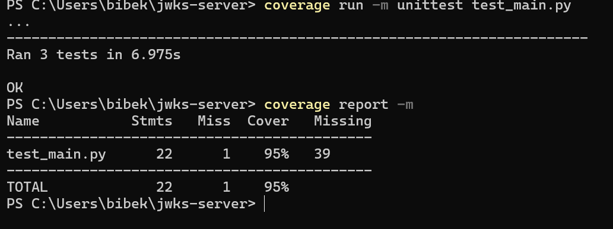
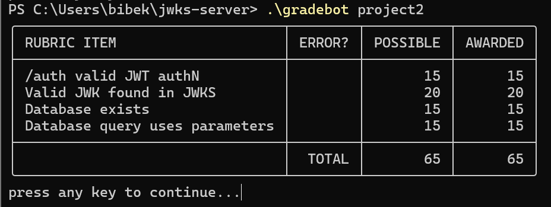

# JWKS Server Project 2

## Project Overview
A RESTful JWKS server that provides public keys for JWT verification, implements key expiry, authentication endpoints, and stores keys in a SQLite database.

## Features
- SQLite database for key storage and persistence
- RESTful endpoints for key retrieval and authentication
- JWT token generation and management
- Secure key storage with expiry tracking
- Parameterized SQL queries for security

## Installation

### Prerequisites
- Python 3.8 or higher
- SQLite3

### Setup
1. Clone the repository:
```bash
git clone https://github.com/beebek-7/jwks_server_project.git
cd jwks_server_project
```

2. Create and activate virtual environment:
```bash
python -m venv venv
# On Windows:
venv\Scripts\activate
# On Unix or MacOS:
source venv/bin/activate
```

3. Install dependencies:
```bash
pip install -r requirements.txt
```

## Usage

### Starting the Server
```bash
python main.py
```
The server will run on `localhost:8080`

### Endpoints

1. JWKS Endpoint
- URL: `/.well-known/jwks.json`
- Method: `GET`
- Response: JSON Web Key Set containing valid public keys

2. Authentication Endpoint
- URL: `/auth`
- Method: `POST`
- Parameters:
  - `expired` (optional): Get JWT signed with expired key
- Body (optional):
  ```json
  {
    "username": "userABC",
    "password": "password123"
  }
  ```
- Response: JWT token

## Testing
Run tests with coverage:
```bash
coverage run -m unittest test_main.py
coverage report -m
```

Current test coverage: 95%

## Database Schema
```sql
CREATE TABLE IF NOT EXISTS keys(
    kid INTEGER PRIMARY KEY AUTOINCREMENT,
    key BLOB NOT NULL,
    exp INTEGER NOT NULL
)
```

## Security Features
- Parameterized SQL queries to prevent injection
- Secure key storage in SQLite database
- Automatic key expiration handling
- Authentication endpoint with credential verification


## Author
- Bibekekananda Pandey
- Student ID: 11811278
- Course: CSCE3550

## Screenshots 
### Test Coverage Results


### Gradebot Results

